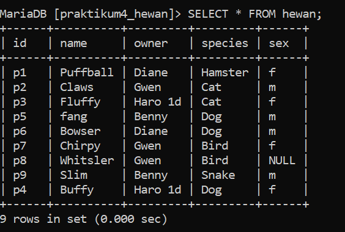

# Praktikum4

```
Nama    : Abid Lu'ay Raihan Taufik
Nim     : 312210401
Kelas   : TI.22.A4
```
# **Query Filtering**

Query filtering mengacu pada proses memfilter atau membatasi data yang diambil dari database berdasarkan kriteria tertentu. Dalam konteks basis data, query filtering melibatkan penggunaan klausa "WHERE" dalam perintah SQL untuk mengatur kondisi atau kriteria yang harus dipenuhi oleh data yang ingin diambil.

Dengan menggunakan query filtering, Anda dapat menentukan kondisi seperti kesamaan, ketidaksamaan, rentang nilai, atau kombinasi kondisi lainnya untuk memilih subset data yang relevan dari tabel. Ini membantu Anda memfokuskan pada data yang spesifik atau memenuhi persyaratan tertentu.
## **Tugas Praktikum**

**TABEL pegawai**   

1. Tampilkan pegawai yang gajinya bukan 2.000.000 dan 1.250.000!
  - Perintah
    ```sql
    SELECT * FROM pegawai WHERE gaji <> 2000000 AND gaji <> 1250000;
    ```
  - Output
    
    2. Tampilkan pegawai yang tunjangannya NUL!
  - Perintah
    ```sql
    SELECT * FROM pegawai WHERE tunjangan IS NULL;
    ```
  - Output
    
    3. Tampilkan pegawai yang tunjangannya tidak NULL!
  - Perintah
    ```sql
    SELECT * FROM pegawai WHERE tunjangan IS NOT NULL;
    ```
  - Output
    
    4. Tampilkan/hitung jumlah baris/record tabel pegawai!
  - Perintah
    ```sql
    SELECT COUNT(*) AS jumlah_baris FROM pegawai;
    ```
  - Output
    
    5. Tampilkan/hitung jumlah total gaji di tabel pegawai!
  - Perintah
    ```sql
    SELECT SUM(gaji) AS total_gaji FROM pegawai;
    ```
  - Output
    
    6. Tampilkan/hitung jumlah rata-rata gaji pegawai!
  - Perintah
    ```sql
    SELECT AVG(gaji) AS rata_gaji FROM pegawai
    ```
  - Output
    
    7. Tampilkan gaji terkecil!
  - Perintah
    ```sql
    SELECT MIN(gaji) AS gaji_terkecil FROM pegawai;
    ```
  - Output
    
    8. Tampilkan gaji terbesar!
  - Perintah
    ```sql
    SELECT MAX(gaji) AS gaji_terbesar FROM pegawai;
    ```
  - Output
    
    ```
    ```
    **TABEL hewan**     

  
  1. Tampilkan jumlah hewan yang dimiliki setiap owner!
  - Perintah
    ```sql
    SELECT owner, COUNT(*) AS jumlah_hewan FROM hewan GROUP BY owner;
    ```
  - Output
    
    2. Tampilkan jumlah hewan berdasarkan spesies!
  - Perintah
    ```sql
    SELECT species, COUNT(*) AS jumlah_hewan FROM hewan GROUP BY species;
    ```
  - Output
    
    3. Tampilkan jumlah hewan berdasarkan jenis kelamin!
  - Perintah
    ```sql
    SELECT sex, COUNT(*) AS jumlah_hewan FROM hewan GROUP BY sex;
    ```
  - Output
    
    4. Tampilkan jumlah hewan berdasarkan spesies dan jenis kelamin!
  - Perintah
    ```sql
    SELECT species,sex, COUNT(*) AS jumlah_hewan FROM hewan GROUP BY species,sex;
    ```
  - Output
    
    5. Tampilkan jumlah hewan berdasarkan spesies (cat dan dog saja) dan jenis kelamin!
  - Perintah
    ```sql
    SELECT species,sex, COUNT(*) AS jumlah_hewan FROM hewan
    WHERE species IN('Cat','Dog')
    GROUP BY species,sex;
    ```
  - Output
    
    6. Tampilkan jumlah hewan berdasarkan jenis kelamin yang diketahui saja!
  - Perintah
    ```sql
    SELECT sex, COUNT(*) AS jumlah_hewan FROM hewan
    WHERE sex IN('f','m')
    GROUP BY sex;
    ```
  - Output
    
    ### **Kesimpulan**

Query filtering adalah proses menyaring atau memfilter data dari basis data berdasarkan kriteria tertentu menggunakan perintah query dalam bahasa SQL. Tujuan utama dari query filtering adalah membatasi atau mengambil subset data yang sesuai dengan kondisi yang ditentukan.  
Dengan menggunakan query filtering, Anda dapat menentukan berbagai jenis kondisi seperti kesamaan (equal), ketidaksamaan (not equal), rentang nilai (range), kondisi logis (AND, OR), atau kombinasi kondisi lainnya. Dengan mengatur kondisi yang sesuai, Anda dapat mengambil hanya data yang relevan atau yang memenuhi persyaratan tertentu.
